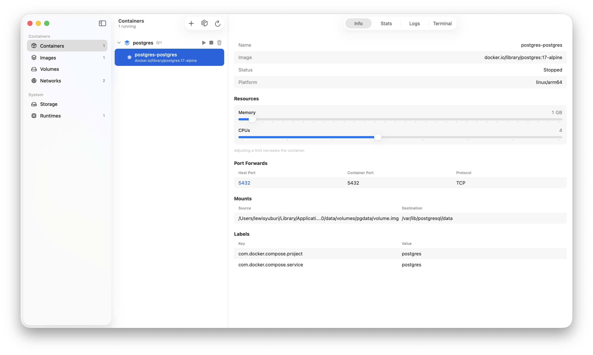
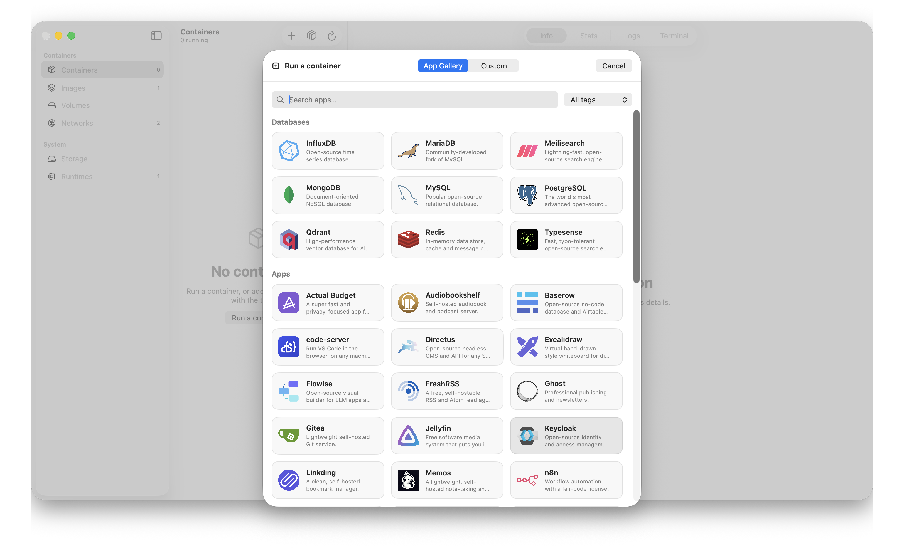
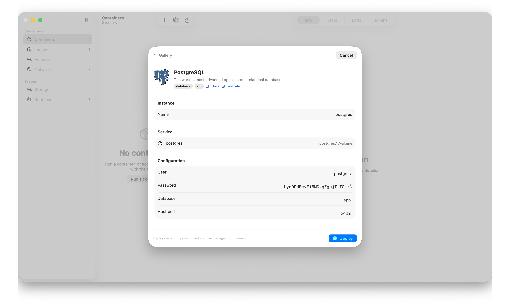
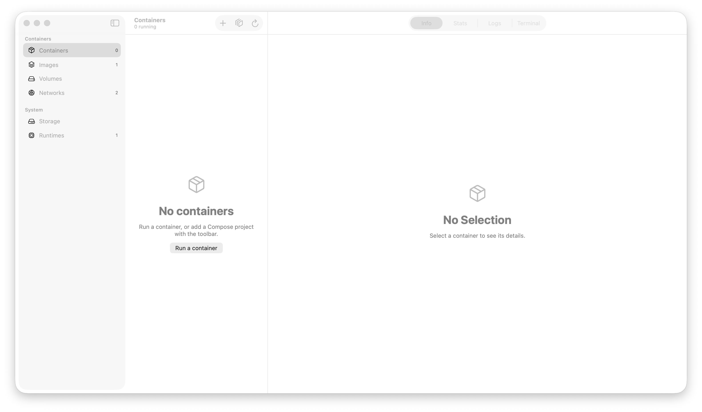

# Crane

A native macOS app for managing [Apple's `container`](https://github.com/apple/container) tool — an OrbStack-style GUI for running Linux containers on Apple Silicon, built with SwiftUI for macOS 26 (Liquid Glass).

> ⚠️ **Early / experimental.** Crane drives Apple's young `container` runtime; some features (notably multi-service stacks) depend on runtime capabilities that are still maturing — see [Limitations](#limitations).

## Screenshots

| Containers | App gallery |
|---|---|
|  |  |
|  |  |

## Features

- **Containers** — start / stop / delete, live logs, an embedded shell (PTY), and live CPU/memory/network stats.
- **Adjustable resources** — change a container's RAM/CPU with sliders; Crane recreates it in place.
- **Docker Compose** — add a `compose.yaml` and bring projects up/down, grouped in the containers list.
- **App gallery** — one-click deploy of ~50 popular apps (Postgres, Redis, n8n, Grafana, MinIO, …) from parametrized Compose templates. Extensible by PR — just drop a folder in [`templates/`](templates/).
- **Images, volumes, networks, disk usage** and a version-managed runtime (download/select Apple `container` releases).
- **Automatic DNS** — injects the host's resolvers so containers reach the internet reliably.

## Install

### Homebrew (cask)

```sh
brew install --cask lewyuburi/tap/crane
```

### Build from source

Requires macOS 26 and a Swift 6.2 toolchain (Xcode 26+).

```sh
git clone https://github.com/lewyuburi/crane
cd crane
./Scripts/bundle.sh --run   # builds build/Crane.app and launches it
```

`swift test` runs the test suite.

## Command line

Installing the app bundles a `crane` CLI (install it from **Settings → Runtimes → Command-line tool**):

```sh
crane ps            # list containers          crane up [path]      # compose up
crane images        # list images              crane down           # compose down
crane logs -f web   # follow a container's log crane templates      # list the app gallery
crane run -p 8080:80 nginx                      crane deploy postgres
```

### Docker compatibility shim

The same binary doubles as a `docker` / `docker-compose` drop-in (opt-in toggle in the same
settings panel — it won't shadow a real Docker install without asking). It maps the common verbs
onto Apple's runtime:

```sh
docker run -d --rm -p 8080:80 nginx
docker compose -f stack.yml up -d
docker build -t me:1 .          # passed through to `container build`
```

It's honest about the gaps: anything Apple's runtime can't do (`--add-host`, custom networks,
multi-service `docker compose logs`) is reported with a clear warning rather than silently faked.

## How it works

Crane shells out to the stable `container` CLI (with `--format json`) rather than its private XPC API, so it stays resilient across runtime upgrades. The container-orchestration logic lives in a UI-agnostic core (`ComposeEngine`, `ContainerControlling`, `ComposeParsing`) that's covered by tests and reusable headlessly.

## Limitations

Apple's `container` is new; a few things differ from Docker Desktop:

- **One micro-VM per container** with a fixed memory size (default 1 GB) — Crane lets you raise it per container.
- **Multi-service stacks are experimental.** Container-to-container DNS is flaky and works only on the default network; Crane runs stacks there with auto-retries, but it's not yet as reliable as Docker. ([apple/container#856](https://github.com/apple/container/issues/856))

## Contributing templates

Add a folder under [`templates/`](templates/) with a `template.json` (metadata + variables) and a `docker-compose.yml`, then open a PR. See existing templates for the format.

## License

MIT — see [LICENSE](LICENSE).
